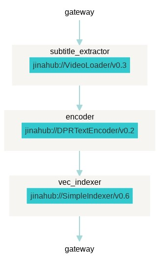
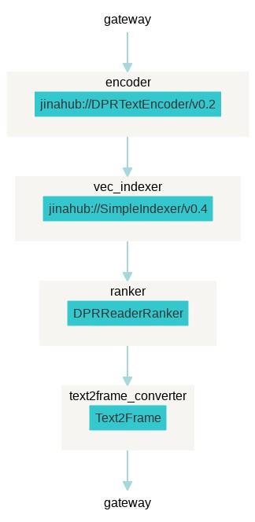

# Build a Question-Answering System for in-Video Contents

```{article-info}
:avatar: avatars/nan.jpg
:avatar-link: https://jobs.jina.ai
:avatar-outline: muted
:author: Nan @ Jina AI
:date: Oct. 24, 2021
```


As a way of searching, asking questions is a natural way to perform searching. For example, when you want to know the definition of Document in Jina, you will naturally ask, "__What is the Document in Jina?__". The expected answer can be found either from the documentation of Jina or the introduction videos at our YouTube channel. Thanks to the latest advances in NLP, the AI models can automatically find these answers from the contents. 

The goal of this tutorial is to build a Question-Answering (QA) system for in-Video Contents. Although most of the existing QA models only work for text, most videos in our life have vocal sound which contains rich information about the video and can be converted into text via [__STT__](https://en.wikipedia.org/wiki/Speech_recognition). Thereafter, videos with vocal sound naturally fits to the way of Question-Answering via text.

In this tutorial, we will show you how to find the extract contents from videos that answer the question. 
Instead of returning the related videos, the QA models can tell the user from which second to watch in order to get the answer to the question.

```{figure} ../../.github/images/tutorial-video-qa.gif
:align: center
```

## Build the Flow
To convert vocal information of the videos into texts, we can rely on STT algorithms. Fortunately, for most of the
videos at YouTube, one can download the subtitles that are generated automatically via STT. In this example, we assume
the video files have subtitles already embedded. By loading the subtitles, we can get the texts of the vocal sounds together
with the beginning and ending timestamp.

```{admonition} Tips
:class: info

You can use `youtube-dl` to download the YouTube videos with subtitles embedded via

:::text
youtube-dl --write-auto-sub --embed-subs --recode-video mkv -o zvXkQkqd2I8 https://www.youtube.com/watch\?v\=zvXkQkqd2I8
:::
```

```{admonition} Note
:class: important

The subtitles generated via STT are not 100% precise. Usually, you need to post-process the subtitles. For example, in 
the toy-data, we use an introduction video of Jina. In the auto-generated subtitles, `jina` is mis-spelled into `gena`, 
`gina` and etc. Worsestill, most of the sentences are broken and there is no punctuation. 
```

With the subtitles of the videos, we further need a QA model. The input to the QA model usually has two parts, namely 
the question and the context. The context denotes the candidate texts that contain the answers. To save the 
computation cost, we want to have the context as short as possible. To generate such contexts, one can use either traditional information sparse vectors or dense vectors. In this example, we decide to use the dense vectors that are shipped together with the QA model.


```{admonition} Note
:class: info

With the traditional methods, the retrieval part can also be done via using BM25, Tf-idf and etc.
```

### Choose executors

To extract the subtitles from the videos, we use `VideoLoader` to extract. It uses `ffmpeg` to extract the subtitles 
and afterwards generated chunks based on the subtitles with `webvtt-py`. The subtitles are stored in the `chunks` 
together with the timestamp information and the video information at `tags`. The extracted subtitles have the following attributes, 

| tags | information |
| -- | ---- |
| `text` | the text of the subtitle |
| `location` | the index of the subtitle in the video, starting from `0` |
| `modality` | always set to `text` |
| `tags['beg_in_seconds']` | the beginning of the subtitle in seconds |
| `tags['end_in_seconds']` | the end of the subtitle in seconds |
| `tags['video_uri']` | the uri of the video |

For the QA model, we choose the [`Dense Passage Retrieval (DPR)`](https://huggingface.co/transformers/model_doc/dpr.html) models that are originally proposed by [Facebook Research](https://github.com/facebookresearch/DPR). It consists of two parts. The first part is an embedding model to encode the questions and answers into vectors that in the same space. With the first part, we can retrieve the candidate sentences that are most likely to contain the answer. The second part is a reader model that can extract the exact answers from the candidate sentences.

```{admonition} Note
:class: info

`DPR` is a set of tools and models for open domain Q&A task.
```

As for the indexer, we choose `SimpleIndexer` for demonstration purposes. It stores both vectors and meta-information at the same time. You can find more information at [hub.jina.ai](https://hub.jina.ai/executor/zb38xlt4)

## Go through the Flow
As the indexing and querying flows have only one shared executor, we create seperated flows for them.

### Index

There are three executors defined in the index Flow, namely `VideoLoader`, `DPRTextEncoder` and `SimpleIndexer`. The index requests contains Documents that have the path information of the video files stored at the `uri` attributes. The `VideoLoader` extracts the subtitles and store them in the `chunks`. Afterwards, each chunk of the Documents has one subtitle stored in the `text` attribute. The `DRPTextEnocder` encodes the subtitles into vectors which are later stored by `SimpleIndexer` together with other meta information. 



### Query

The query flow consists of `DPRTextEncoder`, `SimpleIndexer`, `DPRReaderRanker` and `Text2Frame`. The `DPRTextEncoder` encodes the question that is stored in the `text` attribute of the query Document. This resulted vector is used to retrieve the related subtitles by finding the nearest neighbours in the vector space. This is done in the `SimpleIndexer` .
The retrieved results are stored in the `matches` attribute of the query Document. Each Document in the `matches` has all the meta information about the subtitles as well, which is retrieved by the `SimpleIndexer` together with subtitle texts.
To save the compuation costs for the `DPRReaderRanker`, only the top 20 matches are kept for processing in the downstreaming executors. The number of matches to be kept can be modified by setting the `limit` argument for the `SimpleIndexer`.

```{code-block} YAML
---
emphasize-lines: 3
---
  # index.yml
  ... 
    uses: jinahub://SimpleIndexer/v0.4
    uses_with:
        limit: 20
  ...
```

Afterwards, `DPRReaderRanker` find the exact the answers by using the question and the candidate subtitles. The question and the candidate subtitles are stored in the `text` attributes of the Document and its `matches` correspondingly. 
Replacing the existing `matches`, the `DPRReaderRanker` stores the best matched answers in the `text` attribute of the `matches`. The other meta information are copied into the new matches as well, including `tags['beg_in_seconds']`, `tags['end_in_seconds']`, and `tags['video_uri']`. The `DPRReaderRanker` returns two types of `scores`. The `scores['relevance_score']` measures the relavance to the question of the subtitle from which the answer is extracted. The `scores['span_score']` indicates the weight of the extracted answer among the subtitle. 

As the last step, `Text2Frame` is a customized executor which is used to get the video frame information from the retrieved answers and prepare the Document `matches` for the displaying at the frontend. The overall diagram of the query Flow is shown as below 



### Use `DPRTextEncoder` differently in two Flows

You might note that `DPRTextEncoder` is used in both index and query Flows. However, it is used to encode the subtitle texts in the index Flow and to encode the query questions in the query Flow. In these two cases, we need to choose different models and encode different attributes of the Documents. To achieve this, we use different initialization settings for `DPRTextEncoder` by overriding the `with` arguments in the YAML file. To override the `with` argument when defining the Flows, we need to pass the new argument to `uses_with`. You can find more information at [docs.jina.ai](https://docs.jina.ai/fundamentals/flow/add-exec-to-flow/#override-with-configuration).


```{code-block} YAML
---
emphasize-lines: 5, 6, 7, 8, 9
---
  # index.yml
  ... 
  - name: encoder
    uses: jinahub://DPRTextEncoder/v0.2
    uses_with:
      pretrained_model_name_or_path: 'facebook/dpr-ctx_encoder-single-nq-base'
      encoder_type: 'context'
      traversal_paths:
        - 'c'
  ...
```

```{code-block} YAML
---
emphasize-lines: 5, 6, 7, 8
---
  # query.yml
  ... 
  - name: encoder
    uses: jinahub://DPRTextEncoder/v0.2
    uses_with:
      pretrained_model_name_or_path: 'facebook/dpr-question_encoder-single-nq-base'
      encoder_type: 'question'
      batch_size: 1
  ...
```

## Get the Source Code

You can find the codes at [example-video-qa](https://github.com/jina-ai/example-video-qa).

As for the executors used in this tutorial, most of them are available at Jina Hub

- [`VideoLoader`](https://hub.jina.ai/executor/i6gp4vwu)
- [`DPRTextEncoder`](https://hub.jina.ai/executor/awl0jxog)
- [`DPRReaderRanker`](https://hub.jina.ai/executor/gzhiwmgg)
- [`SimpleIndexer`](https://hub.jina.ai/executor/zb38xlt4)


## Next Steps

In this example, we reply on the subtitles embedded in the video. This might not be the case for some home-made videos or the meeting recordings. For the videos without subtitles, we need to build executors using STT models to extract the vocal information. If the video contains other sounds, one can resort to [VADSpeechSegmenter](https://hub.jina.ai/executor/9sohw4wi) for separating the vocal sounds beforehand.

Another direction to extend this example is to consider more text information of the videos. Although subtitles contain rich information about the video, not all the text information is included in the subtitles. A lot of videos have text information embedded in the images. In such cases, we need to reply on OCR models to extract the text information from the video frames. 

Overall, searching in-video content is a complex task and Jina makes it a lot easier.